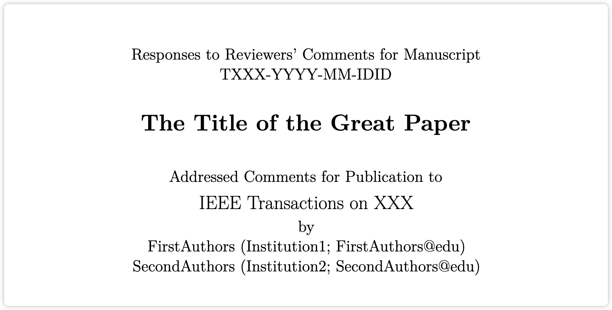
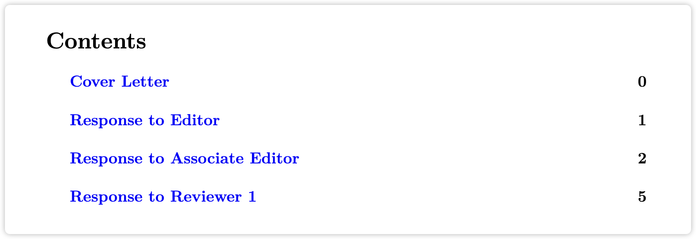
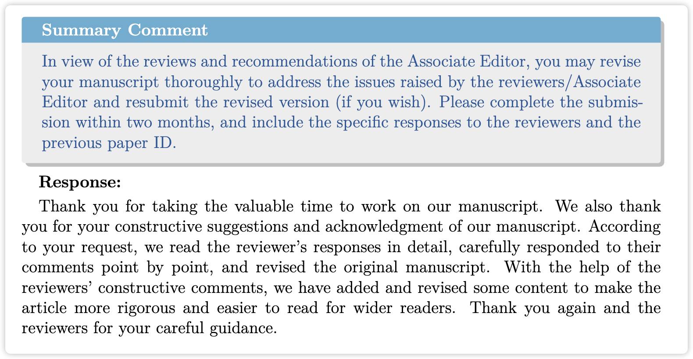
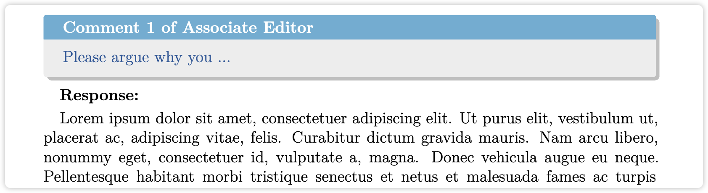
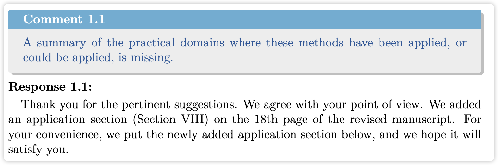
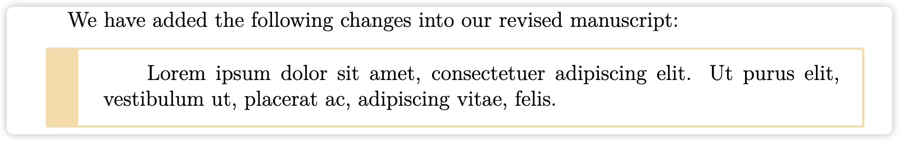
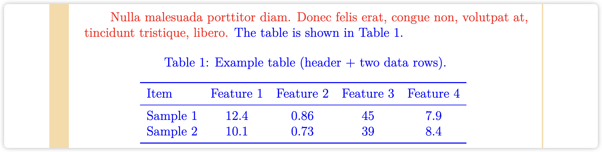

# Journal Response Template Instructions

期刊回复 latex 模板简明引导。修改自[Journal-Response-Letter-Template-Latex](https://github.com/shellywhen/Journal-Response-Letter-Template-Latex)和[Latex Template for Review Comments of Papers](https://github.com/NeuroDong/Latex_for_review_comments)。Thanks!

---
### How to Compile 

```shell
rm -rf build/
latexmk -xelatex -synctex=1 -file-line-error -interaction=nonstopmode -outdir=build review_response.tex
```

---
### 文件树
```shell
.
├─ Responses/                   # 写回复
│  ├─ AssociateEditor.tex       # 给副主编的回复
│  ├─ Editor.tex                # 给主编的回复  
│  ├─ R1.tex                    # 给审稿人 1 的回复 
│  └─ R2.tex                    # 给审稿人 2 的回复 
├─ utils/                       # 放一些插入内容
│  ├─ algorithms/               # 插入算法
│  │  ├─ algo1.tex             
│  │  └─ algo2.tex              
│  ├─ figures/                  # 插入图
│  │  ├─ figure1.tex            
│  │  └─ figure2.tex      
│  ├─ imgs/                     # 图源文件
│  │  ├─ sample1.png
│  │  └─ sample2.png
│  └─ tables/                   # 插入表格
│     ├─ table1.tex
│     └─ table2.tex
├─ compile.sh                   # 编译 latex 命令
├─ cover_letter.tex             # 封面信
├─ literature.bib               # 参考文献
├─ review_response.tex          # 主文件
└─ reviewresponse.sty           # 样式
```

---

### ✍️封面基本信息修改

封面期刊信息、封面手稿编号 [review_response.tex#L9-10](./review_response.tex#L9-10)

```latex
\usepackage[journal={IEEE Transactions on Pattern Analysis and Machine Intelligence},
			manuscript={TPAMI-yyyy-mm-idid},
			editor={Mrs. Joyce Arnold}]{reviewresponse}
```

脚注手稿编号 [review_response.tex#L115](./review_response.tex#L115)

```latex
% 在 review_response.tex#L107
\fancyfoot[L]{Response Letter for TPAMI-yyyy-mm-idid} 
```

标题与作者信息  [review_response.tex#L97-100](./review_response.tex#L97-100)

```latex
\title{}
\author{}
```



> 封面示例


### ⚙️ 预设命令

1. 主编、副主编（如有）、审稿人

```latex
\begin{document}
...
\editor
Response to the editor

\AssociateEditor % 如有副主编
Response to the associate editor

\reviewer
Response to the first reviewer

\reviewer
Response to the second reviewer
```



> 目录示例


2. General Comment

概述一下主编、副主编或审稿人的 general comment

```latex
\begin{generalcomment}
概述一下主编、副主编或审稿人的 general comment
\end{generalcomment}
```

```latex
\begin{revmeta}[Optional Parameter]
写我们对于 general comment 的回复
\end{revmeta}
```



> Summary Comment 示例

3. 副主编的单条 comment

```latex
\begin{revcommentToAssociateAuthor}
复述一下副主编的意见
\end{revcommentToAssociateAuthor}
```

也用`\begin{revmeta}[]` 回复



> 副主编的单条 Comment 示例


4. 审稿人的单条 comment（带编号）

```latex
\begin{revcomment}
复述审稿人的意见
\end{revcomment}
```

```latex
\begin{revresponse}[Optional Parameter]
写我们的回复
\end{revresponse}
```



> 审稿人的单条 Comment 示例


5. 插入 Changes

用```\begin{changes} ... \end{changes}```包裹



> Changes


### ⚠️ 关键自定义部分

1. Cover Letter 在目录中显示为 **Cover Letter 或 Preface**（根据期刊要求），在 [cover_letter.tex#L4](cover_letter.tex#L4) 中定义

```latex
\addcontentsline{toc}{section}{\protect\numberline{}Cover Letter}  % 显示为 Cover Letter
```

2. 当前模板中 [cover_letter.tex#L34](cover_letter.tex#L34) 指出修改部分为**红字**标出，新加部分为**蓝字**标出（部分期刊要求 track changes）。需根据自己的 paper 修改这句话，并修改[reviewresponse.sty#L41-42](reviewresponse.sty#L41-42) 中的颜色定义

```latex
\textbf{In the revised manuscript, modified parts are marked in red, and newly added parts are marked in blue.}
```

```latex
\newcommand{\modified}[1]{\textcolor{red}{#1}}
\newcommand{\added}[1]{\textcolor{blue}{#1}}
```

注意：table、algorithm 等环境外需要包裹``` \begin{addedenv} ... \end{addedenv} ``` 需要同步修改颜色 [reviewresponse.sty#L44-51](reviewresponse.sty#L44-51)

```latex
\newenvironment{addedenv}{
  \begingroup
  \arrayrulecolor{blue}
  \captionsetup{labelfont={color=blue}, textfont={color=blue}}%
  \color{blue}%
}{%
  \endgroup
}
```



> Track Changes 示例


### 其他自定义部分

1. 配色自定义（[reviewresponse.sty#L26-39](reviewresponse.sty#L26-39)）

```latex
% comment box color
\definecolor{colorcommentbg}{HTML}{ededed}  % comment background
\definecolor{colorcommentframe}{HTML}{8faadc}  % comment title background 

% response text color (including tables)
\definecolor{maintext}{HTML}{000000}
\definecolor{commenttext}{HTML}{23579A}

%%%% change box color
\definecolor{colorchangebg}{HTML}{f9daa6} % change box sidebar
\definecolor{colorchangetext}{HTML}{000000}  % change text
```