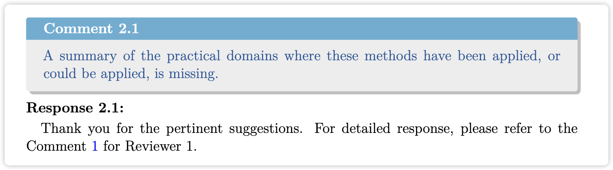
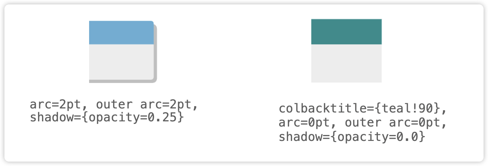

# Journal Response LaTeX Template

[中文](README_cn.md)

A LaTeX template for journal response letters. Modified from [Journal-Response-Letter-Template-Latex](https://github.com/shellywhen/Journal-Response-Letter-Template-Latex) and [Latex Template for Review Comments of Papers](https://github.com/NeuroDong/Latex_for_review_comments). Thanks for the great groundwork.


### How to Compile

```shell
rm -rf build/
latexmk -xelatex -synctex=1 -file-line-error -interaction=nonstopmode -outdir=build review_response.tex
```

The compiled PDF is generated at `./build/review_response.pdf`.


### How to Use


#### File Tree

```shell
.
├─ Responses/                   # Write responses here
│  ├─ AssociateEditor.tex       # Response to the Associate Editor
│  ├─ Editor.tex                # Response to the Editor
│  ├─ R1.tex                    # Response to Reviewer 1
│  └─ R2.tex                    # Response to Reviewer 2
├─ utils/                       # Reusable inserts
│  ├─ algorithms/               # Algorithm snippets
│  │  ├─ algo1.tex
│  │  └─ algo2.tex
│  ├─ figures/                  # Figure snippets
│  │  ├─ figure1.tex
│  │  └─ figure2.tex
│  ├─ imgs/                     # Image assets
│  │  ├─ sample1.png
│  │  └─ sample2.png
│  └─ tables/                   # Table snippets
│     ├─ table1.tex
│     └─ table2.tex
├─ compile.sh                   # Build script
├─ cover_letter.tex             # Cover letter
├─ literature.bib               # Bibliography
├─ review_response.tex          # Main file
└─ reviewresponse.sty           # Style file
```


#### ✍️ Cover Page - Basic Fields

Journal info and manuscript ID on the cover page: [review_response.tex#L9-10](./review_response.tex#L9-10)

```latex
\usepackage[journal={IEEE Transactions on XXX},
            manuscript={TXXX-YYYY-MM-IDID},
            editor={Mrs. Joyce Arnold}]{reviewresponse}
```

Manuscript ID in the footer: [review_response.tex#L115](./review_response.tex#L115)

```latex
% around review_response.tex#L107
\fancyfoot[L]{Response Letter for TXXX-YYYY-MM-IDID}
```

Title and author info: [review_response.tex#L97-100](./review_response.tex#L97-100)

```latex
\title{}
\author{}
```


> Cover example

---

#### ⚙️ Preset Commands

1. Editor / Associate Editor (if any) / Reviewers

```latex
\begin{document}
...
\editor
Response to the editor

\AssociateEditor % if an associate editor is involved
Response to the associate editor

\reviewer
Response to the first reviewer

\reviewer
Response to the second reviewer
```


> TOC example

2. General Comment

Provide a high-level summary of the editor’s/associate editor’s/reviewer’s general comment:

```latex
\begin{generalcomment}
A brief summary of the editor’s/associate editor’s/reviewer’s general comment.
\end{generalcomment}
```

Your meta-level response:

```latex
\begin{revmeta}[Optional Parameter]
Our response to the general comment.
\end{revmeta}
```


> Summary Comment example

3. Single comment from the Associate Editor

```latex
\begin{revcommentToAssociateAuthor}
Restate the associate editor’s comment.
\end{revcommentToAssociateAuthor}
```

Reply using `\begin{revmeta}[] ... \end{revmeta}`.


> Single Comment example (Associate Editor)

4. Single reviewer comment (numbered)

```latex
\begin{revcomment}
Restate the reviewer’s comment.
\end{revcomment}
```

```latex
\begin{revresponse}[Optional Parameter]
Our response.
\end{revresponse}
```


> Single Comment example (Reviewer)

5. Insert “Changes”

Wrap content with:

```
\begin{changes}
...
\end{changes}
```


> Changes example

6. Label cross-references

```latex
\begin{revcomment}
A summary of the practical domains where these methods have been applied, or could be applied, is missing.
\label{com:rev1:Q1}
\end{revcomment}
```

```latex
For the detailed response, please refer to Comment~\ref{com:rev1:Q1} for Reviewer 1.
```



> Label cross-reference example

---

#### ⚠️ Key Customization Areas

1. Show the Cover Letter in the TOC as **Cover Letter** or **Preface** (as required by the journal), set in [cover_letter.tex#L4](cover_letter.tex#L4):

```latex
\addcontentsline{toc}{section}{\protect\numberline{}Cover Letter}  % Display as “Cover Letter”
```

2. The current template states at [cover_letter.tex#L34](cover_letter.tex#L34) that **modified text is marked in red** and **newly added text is marked in blue** (some journals require “track changes”). Update this sentence to match your paper, and adjust the colors in [reviewresponse.sty#L41-42](reviewresponse.sty#L41-42):

```latex
\textbf{In the revised manuscript, modified parts are marked in red, and newly added parts are marked in blue.}
```

```latex
\newcommand{\modified}[1]{\textcolor{red}{#1}}
\newcommand{\added}[1]{\textcolor{blue}{#1}}
```

Note: for environments like tables/algorithms, wrap them with

```latex
\begin{addedenv}
...
\end{addedenv}
```

and keep the color in sync, as defined in [reviewresponse.sty#L44-51](reviewresponse.sty#L44-51):

```latex
\newenvironment{addedenv}{
  \begingroup
  \arrayrulecolor{blue}
  \captionsetup{labelfont={color=blue}, textfont={color=blue}}%
  \color{blue}%
}{%
  \endgroup
}
```


> Track Changes example

---

#### Color Palette and Styles

1. Color customization ([reviewresponse.sty#L26-39](reviewresponse.sty#L26-39))

```latex
% comment box color
\definecolor{colorcommentbg}{HTML}{ededed}   % comment background
\definecolor{colorcommentframe}{HTML}{8faadc} % comment title background

% response text color
\definecolor{maintext}{HTML}{000000}
\definecolor{commenttext}{HTML}{23579A}

%%%% change box color
\definecolor{colorchangebg}{HTML}{f9daa6}    % change box sidebar
\definecolor{colorchangetext}{HTML}{000000}  % change text
```

2. Comment card styling (e.g., rounded corners, shadow). Edit the `revcomment` environment at [reviewresponse.sty#L136](reviewresponse.sty#L136):

```latex
\newenvironment{revcomment}[1][]{\refstepcounter{reviewcomment@counter}
  \begin{tcolorbox}[adjusted title={Comment \arabic{reviewer@counter}.\arabic{reviewcomment@counter}},
    fonttitle={\bfseries}, enhanced jigsaw, colbacktitle={colorcommentframe},
    arc=2pt, outer arc=2pt, opacityframe=0, boxrule=0em, colback={colorcommentbg},
    drop shadow={opacity=0.25}, #1]
}{\end{tcolorbox}}
```



> Comment Card example